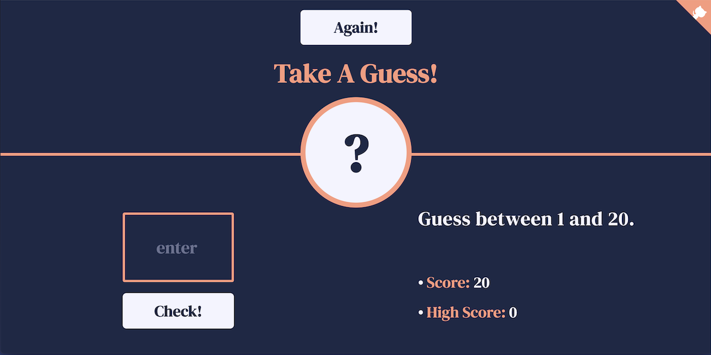

<p id="header"><p>

<table><tr>
<td> <a href="https://github.com/emjose/global-metrics-app/#header"></a> </td>
<td> <a href="https://github.com/emjose/one-hundred/#header"></a> </td>
<td> <a href=#header></a> </td>

</tr></table>

<br>

<p id="project-title"><p>

<a href=#table-of-contents></a>

<br>

<a href="https://take-a-guess.vercel.app/"></a>

#

<p id="table-of-contents"><p>

<a href=#table-of-contents></a>

-   [100 Days of Code](#100days)
-   [Installation](#installation)
-   [Live Site](#live-site)
-   [Resources](#resources)
-   [Let's Connect!](#lets-connect)

#

<p id="100days"><p>

<a href=#100days></a>

### Day 30: November 22, 2021

-   To renew and reinforce my understanding of pure JavaScript, I've been taking courses about JavaScript fundamentals.

-   A course I enjoyed was <a href="https://justjavascript.com/">Just JavaScript</a> by <a href="https://twitter.com/dan_abramov">Dan Abramov</a> and <a href="https://maggieappleton.com/">Maggie Appleton.</a>
-   Another course I'm enjoying is Jonas Schmedtmann's <a href="https://www.udemy.com/course/the-complete-javascript-course/">The Complete JavaScript Course</a>, which has a project about <a href="https://developer.mozilla.org/en-US/docs/Web/API/Document_Object_Model">DOM</a> manipulation that is the basis of this number guessing game.
-   In **Take A Guess**, users guess a number between 1 and 20, and the DOM is manipulated based on the nature of the guess.

#

<p id="installation"><p>

<a href=#installation></a>

#### Git clone and cd into the repo folder:

```
git clone git@github.com:emjose/take-a-guess.git && cd take-a-guess
```

#### Run the command:

```
open index.html
```

#

<p id="live-site"><p>

<a href="https://take-a-guess.vercel.app/"></a>

<a href="https://take-a-guess.vercel.app/"></a>

• The user is informed if their guess is correct or incorrect.

• Correct guesses set the high score, while incorrect guesses decrease the score.

#

<p id="resources"><p>

<a href=#resources></a>

-   #### [Google Fonts](https://fonts.google.com/)

-   #### [HTML Color Codes](https://htmlcolorcodes.com/)

-   #### [SmolCSS](https://smolcss.dev/) by [Stephanie Eckles](https://twitter.com/5t3ph)

-   #### [Just JavaScript](https://justjavascript.com/) by [Dan Abramov](https://twitter.com/dan_abramov) and [Maggie Appleton](https://maggieappleton.com/)

-   #### [The Complete JavaScript Course](https://www.udemy.com/course/the-complete-javascript-course/) by [Jonas Schmedtmann](https://codingheroes.io/)

-   #### [My blog on how I created my Github READMEs](https://emmanueljose.medium.com/readme-a-makeover-story-b9c7be37a6de?sk=7ae6623d365409d875753e4604e42ffd)

#

<p id="lets-connect"><p>

<a href=#lets-connect></a>

<p><a href="https://twitter.com/Emmanuel_Labor"> <a href="https://www.linkedin.com/in/emmanuelpjose/"> <a href="https://emmanueljose.medium.com/"> <a href="https://www.instagram.com/emmanuel_jose/"> <a href="mailto:emjose@gmail.com"> <a href="https://www.emmanuel-jose.com/"> <a href="https://github.com/emjose"></p>

#

<a href=#header></a>
